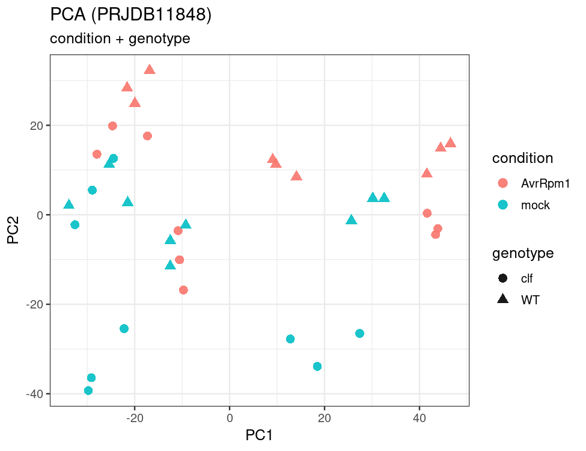

# 4. 标准化与探索性分析 (Normalization and Exploratory Analysis)

## 4.1 Motivation

在进入差异表达检验之前，你需要先理解数据的整体结构：样本之间的关系是否符合实验预期？是否存在批次效应？有没有离群样本？这些问题如果不在统计检验之前回答，你可能会在一个有严重系统偏差的数据集上运行 DESeq2，得到一堆"统计显著但生物学无意义"的结果。

探索性数据分析（Exploratory Data Analysis, EDA）的核心工具是 PCA 和样本距离热图。但在做这些可视化之前，需要先对数据进行适当的标准化和变换。原始计数的方差与均值高度相关（高表达基因方差大），直接在原始计数上做 PCA 会让结果被少数高表达基因主导。方差稳定化变换（VST 或 rlog）正是为了解决这个问题——它让方差与均值脱钩，使得 PCA 和聚类能够反映真实的样本间关系。

本章将在 PRJDB11848 数据集上完成低表达过滤、方差稳定化变换、PCA 分析和样本距离热图，并讨论批次效应的处理策略。

---

## 4.2 环境与数据 (Environment and Data)

本章在 R 中完成，需要以下包：

- DESeq2（标准化、VST 变换）
- pheatmap（热图）
- limma（批次效应可视化校正，可选）
- ggplot2（自定义 PCA 图）

输入：[第 3 章](03-Alignment-and-Quantification.md) 生成的计数矩阵（通过 tximport 或 featureCounts）
输出：VST 变换矩阵、PCA 图、样本距离热图

---

## 4.3 为什么 DESeq2 不接受 TPM

DESeq2 的统计模型基于负二项分布，建模对象是原始计数（raw counts）。它内部会估计 size factors 来校正测序深度和组成偏差（composition bias）。如果你把 TPM 或 FPKM 喂给 DESeq2，会破坏模型的统计假设，导致 p 值不可靠。

!!! warning
    把 TPM 输入 DESeq2 是最常见的错误之一。TPM/FPKM 可以用于展示表达丰度（如热图、条形图），但不能作为 DESeq2 差异检验的输入。如果你使用 Salmon 定量，应通过 tximport 将结果导入 DESeq2，而不是直接使用 TPM 列。

---

## 4.4 过滤低表达基因

低表达基因的计数接近零，方差估计极不稳定，会增加多重检验校正的负担（更多的检验 → 更严格的 FDR 校正 → 更多的假阴性）。过滤掉这些基因可以提高统计效率。

```r
library(DESeq2)

# 保留在至少 k 个样本中 count >= 10 的基因
# k 通常设为最小组的样本数（本例中每组 3 个重复）
keep <- rowSums(counts(dds) >= 10) >= 3
dds <- dds[keep, ]
```

!!! tip "Recommendation"
    过滤阈值没有绝对标准，但 `count >= 10 在至少 k 个样本中` 是一个合理的起点。关键是将过滤标准写进方法部分，保证可复现。不要根据结果反复调整过滤阈值——这属于 p-hacking。

---

## 4.5 数据变换：VST 与 rlog

原始计数的方差与均值高度相关，不适合直接用于 PCA 和聚类。方差稳定化变换（Variance Stabilizing Transformation, VST）和正则化对数变换（rlog）都能让方差与均值脱钩：

```r
vsd <- vst(dds, blind = FALSE)
# 小样本（< 20）时也可考虑 rlog，但更慢：
# rld <- rlog(dds, blind = FALSE)
```

### 选择建议

| 方法 | 速度 | 适用场景 |
| :--- | :--- | :--- |
| `vst` | 快 | 多数场景（样本数 > 20 时尤其推荐） |
| `rlog` | 慢 | 样本很少（< 20）且样本间差异大时可能更稳健 |

!!! note
    `blind = FALSE` 表示变换时考虑实验设计信息。对于 EDA 目的，这通常是合适的——它不会影响后续的差异检验（差异检验使用原始计数），但能让变换后的数据更好地反映生物学差异而非技术噪声。

---

## 4.6 PCA：探索性分析的第一张图

PCA（主成分分析）将高维的基因表达数据投影到少数几个主成分上，让你直观看到样本间的整体关系：

```r
plotPCA(vsd, intgroup = c("condition", "genotype"))
```

<figure markdown>
  { width="680" }
  <figcaption>Fig 4.1 — PRJDB11848 数据集的 PCA 图（VST 变换后）。样本按处理条件和基因型着色。PC1 解释了最大比例的方差，主要反映 AvrRpm1 处理与 mock 对照之间的差异；同一处理条件下的生物学重复紧密聚集，表明数据质量良好且实验设计产生了清晰的生物学信号。</figcaption>
</figure>

解读 PCA 图时重点关注三个问题：

1. **生物学重复是否聚在一起？** 如果同组重复散得很开，可能存在样本质量问题或标签错误。
2. **组间分离是否符合实验预期？** 主效应（如处理 vs 对照）应该在前几个主成分上产生明显分离。
3. **主成分是否被批次主导？** 如果 PC1 按批次分而不是按处理分，说明批次效应很强，需要在模型中纳入。

---

## 4.7 样本距离热图

样本距离热图提供了另一个视角来检查样本间关系和潜在的离群样本：

```r
library(pheatmap)

sample_dists <- dist(t(assay(vsd)))
sample_mat <- as.matrix(sample_dists)

pheatmap(
  sample_mat,
  annotation_col = as.data.frame(colData(dds)[, c("condition", "genotype")]),
  clustering_distance_rows = sample_dists,
  clustering_distance_cols = sample_dists
)
```

热图可以快速发现：离群样本（与所有其他样本距离都远）、标签错误（某个"mock"样本与所有"AvrRpm1"样本聚在一起）、以及批次效应的强度。

---

## 4.8 批次效应处理策略

### 首选：在设计公式中显式纳入

如果你的实验存在已知的批次变量（如不同上机批次、不同实验日期），最推荐的做法是在 DESeq2 的设计公式中直接纳入：

```r
design(dds) <- ~ batch + condition
```

这样 DESeq2 会在估计处理效应时自动控制批次效应。

### 仅用于可视化的批次去除

如果你想在 PCA 图上展示"去除批次效应后"的样本关系，可以用 limma 的 `removeBatchEffect`：

```r
library(limma)
mat <- assay(vsd)
mat_corrected <- removeBatchEffect(mat, batch = colData(dds)$batch)
```

!!! warning
    `removeBatchEffect` 的结果只能用于可视化，**绝对不能**把校正后的矩阵喂回 DESeq2 重新做差异检验。DESeq2 需要原始计数作为输入，批次效应应通过设计公式处理。

---

## 4.9 异常样本处理

发现离群样本后，建议按以下流程处理：

1. **先查技术原因**：回到 FastQC/MultiQC 报告，检查该样本是否有质量问题（低 reads、高重复率、GC 异常）。
2. **再看 PCA 和热图**：确认该样本是否在多个维度上持续离群。
3. **如果剔除，必须记录依据**：在分析记录中写清楚剔除标准和理由。

!!! tip "Recommendation"
    样本剔除标准应在看到差异分析结果之前定义。如果你是在看到 DEG 列表后才决定删掉某个"不好看"的样本，这属于结果导向的数据操纵。

---

## 4.10 常见翻车点

!!! warning "常见翻车点"
    1. **直接在原始 count 上做 PCA**：高表达基因的方差会主导结果，PCA 图反映的是表达量差异而非生物学差异。必须先做 VST 或 rlog 变换。
    2. **未过滤低表达基因**：大量噪声基因会干扰聚类和 PCA，掩盖真实的生物学信号。
    3. **批次效应明显却未纳入设计**：PCA 图上样本按批次分组而非按处理分组，但设计公式里没有 `batch`——差异基因列表会充满批次驱动的假阳性。
    4. **看到离群点直接删除**：没有可追溯的剔除理由，也没有检查技术原因。

---

## 4.11 Key Takeaways

!!! abstract "本章要点"
    1. **先理解数据结构，再做统计检验**——PCA 和样本距离热图是发现批次效应、离群样本和标签错误的最有效工具。
    2. **原始计数不适合直接做 PCA**——必须先做 VST 或 rlog 变换，让方差与均值脱钩。
    3. **DESeq2 只接受原始计数**——TPM/FPKM 用于展示，不用于差异检验输入。
    4. **批次效应通过设计公式处理**——在 `design = ~ batch + condition` 中纳入，而不是用校正后的矩阵替换原始数据。
    5. **低表达过滤提高统计效率**——减少多重检验负担，但过滤标准必须预先定义并记录。
    6. **样本剔除需要可追溯的依据**——先查技术原因，再看统计证据，标准在看到结果之前确定。

---

## 4.12 References

[^love2014]: Love MI, Huber W, Anders S. (2014) Moderated estimation of fold change and dispersion for RNA-seq data with DESeq2. *Genome Biology* 15:550. DOI: [10.1186/s13059-014-0550-8](https://doi.org/10.1186/s13059-014-0550-8)

---

## 4.13 Contributors

### Authors

- *(待补充)*

### Reviewers

- *(待补充)*
