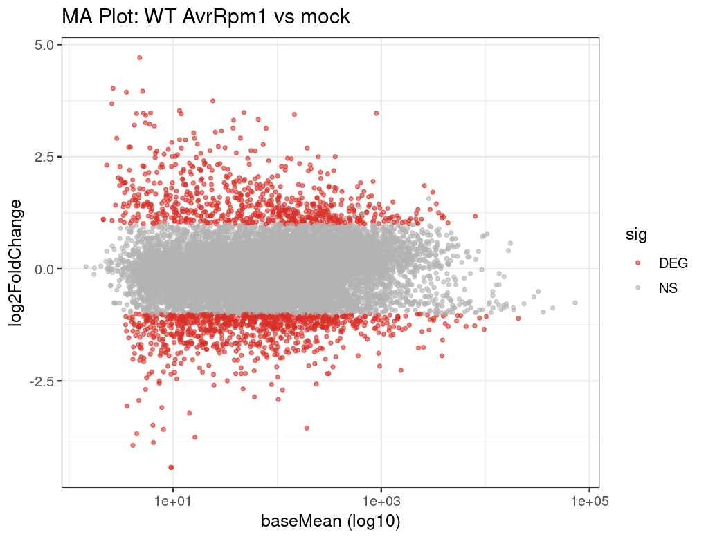

# 5. 差异表达分析 (Differential Expression Analysis)

## 5.1 Motivation

差异表达分析（Differential Expression Analysis, DE）是 RNA-seq 最核心的下游分析步骤。它的本质不是"找 fold change 大的基因"，而是一个统计推断问题：在有限的生物学重复中，区分真实的表达变化与技术噪声和生物学随机波动。这个区分能力直接决定了你能发现多少真实的生物学信号，以及你的结论有多可靠。

为什么这件事不简单？因为 RNA-seq 计数数据有两个特性让简单的统计方法失效：第一，计数天然是离散的，不满足正态分布假设；第二，基因间的方差结构差异巨大——高表达基因的方差通常远大于均值（过离散，overdispersion），而低表达基因的方差估计又极不稳定。如果忽略这些特性直接用 t-test，你会同时得到大量假阳性（高表达基因）和假阴性（低表达基因）。

本章将在 PRJDB11848 数据集上完成一个完整的 DESeq2 差异分析流程。我们将从设计公式开始，经过模型拟合、LFC 收缩、阈值筛选，最终在 WT 中鉴定出 AvrRpm1 vs mock 的 **1,541 个显著差异基因**，并通过 MA 图和火山图可视化这些结果。同时，我们也将检测基因型与处理的交互效应，发现 **56 个交互项显著基因**——这些基因在 clf 突变体中对 AvrRpm1 的响应与野生型不同，暗示表观遗传调控参与了免疫转录重编程。

---

## 5.2 统计模型基础：负二项分布与离散度

DESeq2 使用负二项分布（Negative Binomial distribution）对 RNA-seq 计数建模 [^love2014]。相比泊松分布，负二项分布多了一个离散度参数（dispersion），能够捕捉计数数据中"方差大于均值"的过离散现象。

模型的核心公式：

$$K_{ij} \sim \text{NB}(\mu_{ij}, \alpha_i)$$

其中 $K_{ij}$ 是基因 $i$ 在样本 $j$ 中的计数，$\mu_{ij}$ 是期望值（由设计公式决定），$\alpha_i$ 是基因 $i$ 的离散度。

DESeq2 的三步核心流程：

1. **估计 size factors**：校正样本间的测序深度差异（中位数比值法）。
2. **估计离散度**：先对每个基因独立估计，再通过所有基因的趋势进行收缩（shrinkage），让低表达基因借用全局信息获得更稳定的估计。
3. **Wald 检验**：对每个基因的 log2 fold change 进行假设检验，用 BH 方法校正多重检验。

### 为什么不用 t-test

!!! note
    t-test 假设数据近似正态且方差结构简单。RNA-seq 计数是离散的、过离散的、异方差的——直接用 t-test 会同时产生假阳性和假阴性。DESeq2 的负二项模型和离散度收缩机制正是为了解决这些问题而设计的。在 Schurch 等人的 benchmark 中，DESeq2 在各种重复数条件下都表现出良好的 FDR 控制 [^schurch2016]。

---

## 5.3 设计公式先于检验

设计公式（design formula）定义了你要检验什么。它必须在创建 `DESeqDataSet` 时指定，且应该反映你的实验设计。**先想清楚设计公式，再运行 `DESeq()`**——这个顺序不能反。

对于 PRJDB11848 的多因素设计，我们使用：

```r
# 设置参考水平：mock 为对照，WT 为参考基因型，0h 为基线时间点
colData$condition <- relevel(factor(colData$condition), ref = "mock")
colData$genotype  <- relevel(factor(colData$genotype),  ref = "WT")
colData$time      <- relevel(factor(colData$time),       ref = "0h")

# 设计公式：主效应 + 交互项
dds <- DESeqDataSetFromMatrix(
  countData = counts_mat,
  colData   = colData,
  design    = ~ genotype + time + condition + genotype:condition
)
```

这个设计公式的含义是：在控制基因型和时间点的前提下，检验 condition（AvrRpm1 vs mock）的主效应，同时检验基因型与处理之间是否存在交互作用。

!!! tip "Recommendation"
    **永远在运行 `DESeq()` 之前设好参考水平（reference level）**。如果忘了 `relevel`，DESeq2 会按字母顺序选择参考组——这可能导致 fold change 方向与你的预期相反，而你可能在很晚才发现这个问题。

---

## 5.4 标准 DESeq2 流程

```r
library(DESeq2)

# 运行 DESeq2 三步流程：size factor → dispersion → Wald test
dds <- DESeq(dds)

# 查看模型中的所有系数
resultsNames(dds)
```

在 PRJDB11848 数据上，`resultsNames(dds)` 返回 6 个系数：

```
[1] "Intercept"
[2] "genotype_clf_vs_WT"
[3] "time_0.5h_vs_0h"
[4] "time_3h_vs_0h"
[5] "condition_AvrRpm1_vs_mock"
[6] "genotypeclf.conditionAvrRpm1"
```

每个系数对应一个可检验的效应：

- `condition_AvrRpm1_vs_mock`：**主效应**——在 WT 中，AvrRpm1 处理相对于 mock 的表达变化。
- `genotypeclf.conditionAvrRpm1`：**交互项**——clf 突变体对 AvrRpm1 的响应与 WT 的差异。
- `genotype_clf_vs_WT`：基因型主效应（在 mock 条件下）。
- `time_*_vs_0h`：时间效应。

```r
# 提取主效应结果：WT 中 AvrRpm1 vs mock
res <- results(dds, contrast = c("condition", "AvrRpm1", "mock"))
```

---

## 5.5 LFC 收缩：让估计更可靠

原始的 log2 fold change（LFC）估计对低表达基因非常不稳定——一个基因在对照组有 2 个 count、处理组有 8 个 count，原始 LFC 就是 2，但这个估计的置信区间极宽。如果你直接用这些不稳定的 LFC 做排序或可视化，低表达基因会因为噪声而占据排名前列，掩盖真正重要的信号。

LFC 收缩（shrinkage）通过贝叶斯方法将不可靠的估计向零收缩，让高置信度的大效应保持不变，同时压缩低置信度的极端值 [^zhu2019]。

```r
# 使用 apeglm 方法进行 LFC 收缩（推荐）
res_shrunk <- lfcShrink(
  dds,
  coef = "condition_AvrRpm1_vs_mock",  # 必须用 coef 名，不能用 contrast
  type = "apeglm"                       # apeglm 比 normal 和 ashr 更稳健
)
```

!!! tip "Recommendation"
    我们推荐使用 **apeglm** 方法进行 LFC 收缩 [^zhu2019]。在 Zhu 等人的 benchmark 中，apeglm 在保持大效应基因 LFC 不变的同时，对低信息量基因的收缩更为合理，优于 DESeq2 内置的 `normal` 方法和 `ashr` 方法。收缩后的 LFC 应用于所有下游的排序、可视化和富集分析。

!!! warning
    `lfcShrink` 使用 `coef` 参数时，必须传入 `resultsNames(dds)` 中的精确系数名（如 `"condition_AvrRpm1_vs_mock"`），而不能使用 `contrast` 向量。如果系数名不匹配，函数会静默返回错误结果。

```r
# 保存收缩后的完整结果
res_df <- as.data.frame(res_shrunk)
res_df <- res_df[order(res_df$padj), ]
write.csv(res_df, file = "results/ch5/DEG_WT_AvrRpm1_vs_mock_shrunk.csv")
```

---

## 5.6 阈值设置与结果解读

差异基因的筛选通常基于两个阈值：

- **padj < 0.05**：BH 校正后的 FDR，控制假阳性率。
- **|log2FoldChange| > 1**：对应 2 倍以上的表达变化，过滤掉统计显著但效应量微弱的基因。

```r
# 筛选显著差异基因
deg <- subset(res_df, padj < 0.05 & abs(log2FoldChange) > 1)
nrow(deg)  # PRJDB11848 结果：1541
write.csv(deg, file = "results/ch5/DEG_WT_AvrRpm1_vs_mock_sig.csv")
```

在 PRJDB11848 数据集上，WT 中 AvrRpm1 vs mock 共鉴定出 **1,541 个显著 DEG**。这个数量级与拟南芥 ETI（effector-triggered immunity）响应的已知规模一致——效应蛋白触发的免疫响应涉及大规模的转录重编程，包括防御基因的上调和生长相关基因的下调。

对于交互项（clf 相对于 WT 的差异响应）：

```r
# 提取交互项结果
res_interaction <- results(dds, name = "genotypeclf.conditionAvrRpm1")
res_int_df <- as.data.frame(res_interaction)
deg_int <- subset(res_int_df, padj < 0.05 & abs(log2FoldChange) > 1)
nrow(deg_int)  # 结果：56
```

交互项显著的 **56 个基因**表明，clf 突变体对 AvrRpm1 的转录响应在这些基因上与野生型存在显著差异。这提示 CLF（一个 Polycomb 组蛋白甲基转移酶）参与了免疫转录程序的表观遗传调控。关于交互项的详细解读，参见 [第 9 章](09-Multi-factor-Design.md)。

!!! note
    阈值不应机械固定。`padj < 0.05` 和 `|log2FC| > 1` 是合理的起点，但具体项目中应根据生物学背景调整。对于效应量普遍较小的实验（如药物低剂量处理），降低 LFC 阈值可能更合适；对于关注特定通路而非单基因的分析，GSEA 不需要预先设定 LFC 阈值（参见 [第 6 章](06-Functional-Enrichment-Analysis.md)）。

---

## 5.7 可视化：MA 图与火山图

### MA 图

MA 图以平均表达量（baseMean）为 x 轴、log2 fold change 为 y 轴，展示差异基因在不同表达水平上的分布。它能帮助你判断：（1）差异信号是否集中在合理的表达范围；（2）LFC 收缩是否有效压缩了低表达区域的噪声。

```r
# MA plot（使用收缩后的结果）
plotMA(res_shrunk, ylim = c(-5, 5), main = "MA plot: AvrRpm1 vs mock (WT)")
```

<figure markdown>
  { width="680" }
  <figcaption>Fig 5.1 — WT 中 AvrRpm1 vs mock 的 MA 图（LFC 经 apeglm 收缩）。x 轴为基因平均表达量（baseMean），y 轴为 log2 fold change。蓝色点为显著 DEG（padj < 0.1）。可以看到，收缩后低表达区域（左侧）的极端 LFC 被有效压缩，而高表达区域的大效应基因保持不变。差异信号在各表达水平上均有分布，符合全局免疫转录重编程的预期。</figcaption>
</figure>

### 火山图

火山图以 log2 fold change 为 x 轴、-log10(padj) 为 y 轴，同时展示效应量和统计显著性。它是展示 DE 结果最直观的方式。

```r
library(EnhancedVolcano)

EnhancedVolcano(
  res_df,
  lab = rownames(res_df),
  x   = "log2FoldChange",
  y   = "padj",
  pCutoff  = 0.05,
  FCcutoff = 1,
  title = "Volcano: AvrRpm1 vs mock (WT)",
  subtitle = paste0("DEGs: ", nrow(deg))
)
```

<figure markdown>
  { width="680" }
  <figcaption>Fig 5.2 — WT 中 AvrRpm1 vs mock 火山图。红色点为显著 DEG（padj < 0.05 且 |log2FC| > 1），共 1,541 个。图形呈现明显的双侧分布：大量基因在 AvrRpm1 处理后显著上调（右侧）和下调（左侧），反映了拟南芥对效应蛋白 AvrRpm1 的强烈免疫转录响应——防御相关基因被激活的同时，生长和发育相关基因被抑制。</figcaption>
</figure>

---

## 5.8 高级设置：effect-size 检验

标准流程中，我们先用 Wald 检验获取所有基因的 p 值，再事后用 `|log2FC| > 1` 筛选。但这种"先检验再筛选"的做法在统计上并不严格——p 值检验的零假设是 LFC = 0，而我们真正关心的是 LFC 是否超过某个有生物学意义的阈值。

DESeq2 提供了 `lfcThreshold` 参数，可以直接将效应量阈值纳入假设检验：

```r
# 零假设变为 |LFC| <= 1，备择假设为 |LFC| > 1
res_lfc <- results(
  dds,
  contrast = c("condition", "AvrRpm1", "mock"),
  lfcThreshold = 1,              # 将阈值纳入检验
  altHypothesis = "greaterAbs"   # 双侧检验
)
```

!!! note
    使用 `lfcThreshold` 的结果通常比事后筛选更保守（更少的显著基因），但统计上更一致。当你需要向审稿人证明你的 DEG 不仅统计显著而且效应量足够大时，这个方法特别有用。

---

## 5.9 常见翻车点

!!! warning "常见翻车点"
    1. **技术重复当生物学重复**：同一 RNA 样本的多次测序是技术重复，不能作为独立样本进入 DE 分析。这会严重低估方差，导致大量假阳性 [^schurch2016]。
    2. **忘记设置参考组**：不 `relevel` 就运行 `DESeq()`，DESeq2 按字母顺序选参考组。如果 "AvrRpm1" 排在 "mock" 前面，它会成为参考组，fold change 方向就反了。
    3. **只看 p 值不看效应量**：padj < 0.05 但 log2FC = 0.1 的基因统计显著但生物学意义微弱。始终同时考虑显著性和效应量。
    4. **用未收缩的 LFC 做下游分析**：未收缩的 LFC 在低表达区域噪声极大，用它排序或做 GSEA 会引入大量噪声。下游分析应始终使用 `lfcShrink` 的结果。
    5. **设计公式与实验问题不匹配**：如果你的实验有批次效应但设计公式里没有 `batch`，差异基因列表会混入批次驱动的假阳性。设计公式应反映所有已知的混杂因素。

---

## 5.10 Key Takeaways

!!! abstract "本章要点"
    1. **差异表达分析是统计推断，不是排名**——它的核心任务是在噪声中区分真实信号，而不是简单地按 fold change 排序。
    2. **DESeq2 的负二项模型 + 离散度收缩是当前 bulk RNA-seq DE 分析的标准方法**——它在各种重复数条件下都能良好控制 FDR [^love2014] [^schurch2016]。
    3. **设计公式必须在运行 `DESeq()` 之前确定**——它定义了你要检验什么，参考水平决定了 fold change 的方向。
    4. **LFC 收缩是必要步骤，不是可选优化**——未收缩的 LFC 在低表达区域极不稳定，推荐使用 apeglm 方法 [^zhu2019]。
    5. **阈值应结合生物学背景设定**——`padj < 0.05` + `|log2FC| > 1` 是合理起点，但不是金标准；对于小效应实验或通路层面分析，应灵活调整。
    6. **交互项揭示条件特异性响应**——本案例中 56 个交互项 DEG 提示 CLF 参与免疫转录的表观遗传调控，这类信号在简单的两组比较中会被忽略。
    7. **可视化是质控手段，不只是展示工具**——MA 图检查 LFC 收缩效果和表达水平偏倚，火山图检查信号分布的对称性和异常值。

---

## 5.11 References

[^love2014]: Love MI, Huber W, Anders S. (2014) Moderated estimation of fold change and dispersion for RNA-seq data with DESeq2. *Genome Biology* 15:550. DOI: [10.1186/s13059-014-0550-8](https://doi.org/10.1186/s13059-014-0550-8)

[^zhu2019]: Zhu A, Ibrahim JG, Love MI. (2019) Heavy-tailed prior distributions for sequence count data: removing the noise and preserving large differences. *Bioinformatics* 35(12):2084-2092. DOI: [10.1093/bioinformatics/bty895](https://doi.org/10.1093/bioinformatics/bty895)

[^schurch2016]: Schurch NJ, Schofield P, Gierliński M, et al. (2016) How many biological replicates are needed in an RNA-seq experiment and which differential expression tool should you use? *RNA* 22(6):839-851. DOI: [10.1261/rna.053959.115](https://doi.org/10.1261/rna.053959.115)

[^costa-silva2017]: Costa-Silva J, Domingues D, Lopes FM. (2017) RNA-Seq differential expression analysis: An extended review and a software tool. *PLoS ONE* 12(12):e0190152. DOI: [10.1371/journal.pone.0190152](https://doi.org/10.1371/journal.pone.0190152)

---

## 5.12 Contributors

### Authors

- *(待补充)*

### Reviewers

- *(待补充)*
