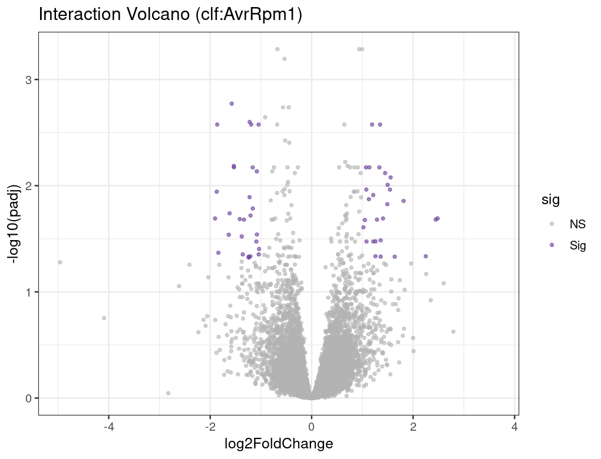

# 9. 多因素与交互作用设计 (Multi-factor Design and Interactions)

## 9.1 Motivation

真实的生物学实验很少只有一个变量。你可能同时操纵了基因型和处理条件，或者在不同组织和时间点上采样。当实验包含两个或更多因素时，最重要的生物学问题往往不是"处理有没有效果"，而是"处理的效果是否依赖于另一个因素"——这就是交互效应（interaction effect）。

以 PRJDB11848 为例：我们不仅想知道 AvrRpm1 在 WT 中是否诱导免疫基因（主效应），更想知道 clf 突变体对 AvrRpm1 的响应是否与 WT 不同（交互效应）。如果某个基因在 WT 中被 AvrRpm1 强烈诱导，但在 clf 中几乎不响应，这个"差异的差异"就是交互效应——它暗示 CLF（一个 Polycomb 组蛋白甲基转移酶）参与了该基因的免疫转录调控。这类信号在简单的两组比较中会被完全忽略。

本章将解释多因素模型中主效应和交互效应的含义，演示如何在 DESeq2 中正确构建模型、提取结果和解读系数，并在 PRJDB11848 上鉴定出 **56 个交互项显著基因**。

---

## 9.2 环境与数据 (Environment and Data)

本章在 R 中完成，需要以下包：

- DESeq2（多因素建模）
- ggplot2（交互图可视化）
- tibble（数据整理）

输入：计数矩阵 + 包含 `genotype`、`condition`、`batch` 等列的 colData
输出：主效应结果、交互项结果、交互火山图

---

## 9.3 核心概念：主效应 vs 交互效应

以两因素设计为例：

```text
design = ~ genotype + condition + genotype:condition
```

- **condition 主效应**：在参考基因型（WT）下，AvrRpm1 vs mock 的差异。
- **genotype 主效应**：在参考处理（mock）下，clf vs WT 的差异。
- **genotype:condition 交互效应**：clf 对 AvrRpm1 的响应与 WT 对 AvrRpm1 的响应之间的差异——即"差异的差异"。

用数学表达：

$$\text{Interaction} = (\text{clf}_{AvrRpm1} - \text{clf}_{mock}) - (\text{WT}_{AvrRpm1} - \text{WT}_{mock})$$

!!! note
    交互效应显著意味着"处理效果依赖于基因型"。它不是说 clf 和 WT 之间有差异（那是主效应），而是说 clf 和 WT 对处理的**响应程度**不同。

---

## 9.4 DESeq2 多因素建模

```r
library(DESeq2)

# 设置参考水平
colData$genotype  <- relevel(factor(colData$genotype),  ref = "WT")
colData$condition <- relevel(factor(colData$condition), ref = "mock")
colData$batch     <- factor(colData$batch)

dds <- DESeqDataSetFromMatrix(
  countData = counts_mat,
  colData   = colData,
  design    = ~ batch + genotype + condition + genotype:condition
)

dds <- DESeq(dds)
resultsNames(dds)
```

在 PRJDB11848 上，`resultsNames(dds)` 返回：

```
[1] "Intercept"
[2] "genotype_clf_vs_WT"
[3] "time_0.5h_vs_0h"
[4] "time_3h_vs_0h"
[5] "condition_AvrRpm1_vs_mock"
[6] "genotypeclf.conditionAvrRpm1"
```

!!! warning "避坑指南"
    一定先看 `resultsNames(dds)` 再提取结果。交互项的名字会随因子命名和参考水平变化（如 `genotypeclf.conditionAvrRpm1`），不要在代码中硬写固定字符串——换一个数据集名字就变了。

---

## 9.5 正确提取结果

多因素模型中，不同的系数回答不同的生物学问题：

```r
# 1) WT 中的处理效应（主效应）
res_treat_in_wt <- results(dds, name = "condition_AvrRpm1_vs_mock")

# 2) 交互效应：clf 对处理的额外响应
res_interaction <- results(dds, name = "genotypeclf.conditionAvrRpm1")

# 3) clf 中的处理总效应 = 主效应 + 交互项
res_treat_in_clf <- results(
  dds,
  list(c("condition_AvrRpm1_vs_mock", "genotypeclf.conditionAvrRpm1"))
)
```

三个结果的解读逻辑：

| 结果 | 含义 | 生物学问题 |
| :--- | :--- | :--- |
| `res_treat_in_wt` | WT 中 AvrRpm1 vs mock | AvrRpm1 在野生型中诱导了哪些基因？ |
| `res_interaction` | clf 相对 WT 的额外响应 | clf 对 AvrRpm1 的响应与 WT 有何不同？ |
| `res_treat_in_clf` | clf 中 AvrRpm1 vs mock 的总效应 | AvrRpm1 在 clf 中诱导了哪些基因？ |

!!! warning
    **不要把主效应当总效应解读**。在含交互项的模型中，`condition_AvrRpm1_vs_mock` 只是 WT（参考基因型）中的处理效应。clf 中的处理效应需要将主效应和交互项相加（第 3 个提取方式）。这是多因素模型中最常见的解读错误。

---

## 9.6 PRJDB11848 交互项结果

```r
# 交互项显著基因
res_int_df <- as.data.frame(res_interaction)
deg_int <- subset(res_int_df, !is.na(padj) & padj < 0.05 & abs(log2FoldChange) > 1)
nrow(deg_int)  # 结果：56
```

<figure markdown>
  { width="680" }
  <figcaption>Fig 9.1 — genotype × condition 交互项火山图。红色点为交互效应显著的基因（padj < 0.05 且 |log2FC| > 1），共 56 个。这些基因在 clf 突变体中对 AvrRpm1 的响应与 WT 显著不同，提示 CLF 介导的表观遗传调控参与了免疫转录程序的调节。</figcaption>
</figure>

---

## 9.7 模型质量检查与可视化

### 设计平衡性检查

多因素模型要求每个因子组合（cell）都有足够的重复。检查设计平衡性：

```r
table(colData(dds)$genotype, colData(dds)$condition)
#          mock AvrRpm1
# WT          9       9
# clf         9       9
```

每个 cell 有 9 个样本（3 个时间点 × 3 个重复），设计是平衡的。

### 单基因交互图

对显著交互基因画分组表达图，直观检查交互效应的方向：

```r
library(ggplot2)
library(tibble)

vsd <- vst(dds, blind = FALSE)
gene_id <- "AT1G67070"  # 交互项最显著的基因

df_plot <- tibble(
  expr      = assay(vsd)[gene_id, ],
  genotype  = colData(dds)$genotype,
  condition = colData(dds)$condition
)

ggplot(df_plot, aes(x = condition, y = expr, color = genotype, group = genotype)) +
  stat_summary(fun = mean, geom = "line", linewidth = 1) +
  stat_summary(fun = mean, geom = "point", size = 3) +
  labs(title = gene_id, y = "VST expression") +
  theme_bw()
```

!!! tip "Recommendation"
    对显著交互基因画分组箱线图或交互图，确认统计结果与可视化一致。如果一个基因交互项显著但图上看不出明显的交互模式，可能是被少数样本驱动的——需要进一步检查。

---

## 9.8 什么时候不该拆组分析

一个常见的错误做法是：把 WT 和 clf 的数据拆开，分别跑 DESeq2，然后比较两个 DEG 列表的重叠。这种做法有两个严重问题：

1. **统计效率损失**：拆组后每组样本量减半，方差估计不稳定，检测灵敏度下降。
2. **无法直接比较**：两个独立分析的 p 值不可比——"WT 中显著但 clf 中不显著"不等于"两者之间有显著差异"。只有交互项检验才能直接回答"差异是否显著不同"。

!!! warning
    "在 A 中显著但在 B 中不显著" ≠ "A 和 B 之间有显著差异"。这是统计学中最常见的误解之一。要检验两组之间的差异是否显著，必须使用交互项检验。

---

## 9.9 常见翻车点

!!! warning "常见翻车点"
    1. **混杂设计**：如果 `batch` 与 `condition` 完全重合（所有 mock 在 batch 1，所有 AvrRpm1 在 batch 2），模型无法区分批次效应和处理效应。这是实验设计阶段的问题，分析阶段无法补救。
    2. **参考水平没设定**：DESeq2 按字母顺序选参考组，导致系数名称和解释完全跑偏。
    3. **把主效应当总效应解读**：在含交互项的模型中，主效应只对应参考水平。clf 中的处理效应 = 主效应 + 交互项。
    4. **拆组分别跑 DESeq2**：损失统计效率，且无法直接比较两组的差异是否显著。

---

## 9.10 Key Takeaways

!!! abstract "本章要点"
    1. **交互效应是"差异的差异"**——它检验的是处理效果是否依赖于另一个因素，而不是两组之间是否有差异。
    2. **主效应在交互模型中只对应参考水平**——要获取非参考水平的效应，必须将主效应和交互项相加。
    3. **不要拆组分析**——拆组损失统计效率，且"A 中显著但 B 中不显著"不等于"A 和 B 之间有显著差异"。
    4. **`resultsNames(dds)` 是提取结果的指南针**——系数名随因子命名和参考水平变化，必须先查看再提取。
    5. **交互项显著的基因数通常远少于主效应**——本案例中 56 vs 1,541，这是正常的，因为交互效应的检测需要更大的样本量。
    6. **可视化是验证交互效应的必要步骤**——统计显著的交互项应在交互图上表现出明显的非平行模式。

---

## 9.11 References

[^love2014]: Love MI, Huber W, Anders S. (2014) Moderated estimation of fold change and dispersion for RNA-seq data with DESeq2. *Genome Biology* 15:550. DOI: [10.1186/s13059-014-0550-8](https://doi.org/10.1186/s13059-014-0550-8)

[^nieuwenhuis2011]: Nieuwenhuis S, Forstmann BU, Wagenmakers EJ. (2011) Erroneous analyses of interactions in neuroscience: a problem of significance. *Nature Neuroscience* 14:1105-1107. DOI: [10.1038/nn.2886](https://doi.org/10.1038/nn.2886)

---

## 9.12 Contributors

### Authors

- *(待补充)*

### Reviewers

- *(待补充)*
