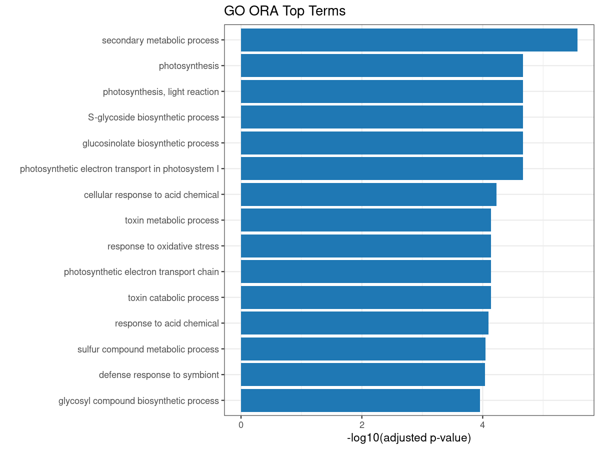
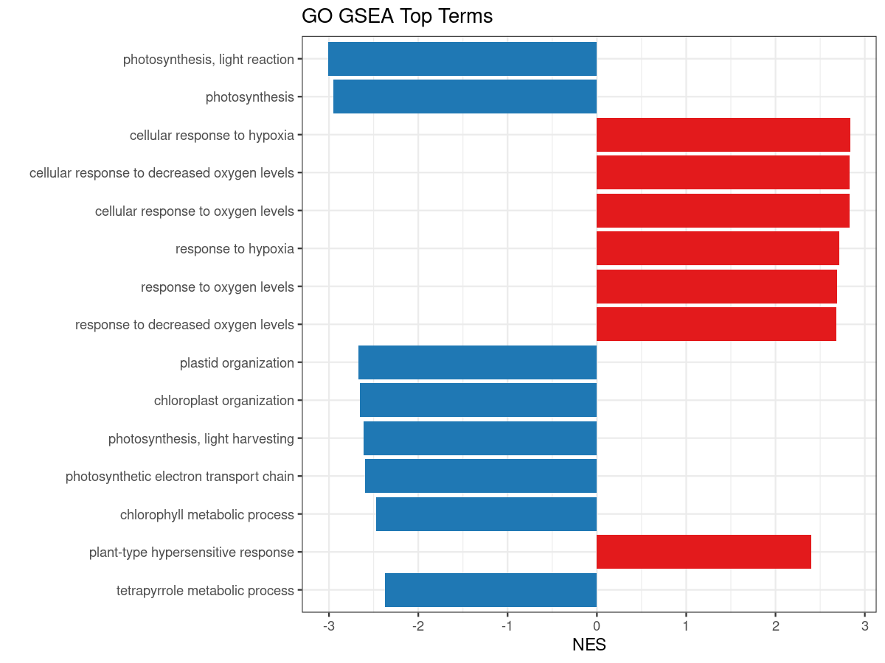
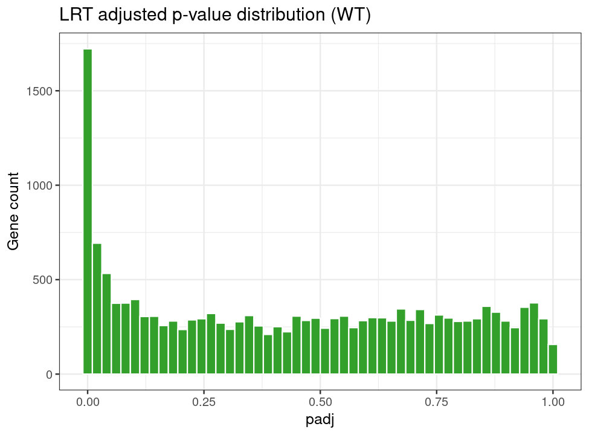

# Chapter 10: 可完整复现实战教程（PRJDB11848）

> 本章是“能直接照做”的版本：给出已实跑成功的代码、每一步会产出的文件、以及真实结果图。

---

## 10.0 代码与结果的网页可见位置

本章同时区分两类路径：

- 运行目录（本地执行时会写入）：`validation_run_downstream/`
- 已上传快照（GitHub 网页可直接查看）：`artifacts/prjdb11848/`

快速入口：

- 产物目录：`artifacts/prjdb11848/`
- 文件清单：`artifacts/prjdb11848/FILELIST.txt`
- 校验文件：`artifacts/prjdb11848/CHECKSUMS.sha256`

---

## 10.1 实战数据与设计

- 数据集：`PRJDB11848`（`Arabidopsis thaliana`）
- 样本数：36（PE，72 个 FASTQ）
- 设计因子：
  - `genotype`: `WT` / `clf`
  - `condition`: `mock` / `AvrRpm1`
  - `time`: `0h` / `0.5h` / `3h`
  - `replicate`: `1..3`

---

## 10.2 运行前准备

在仓库根目录：

```bash
cd RNA-seq-Tutorial
```

确保工具可用：

- `wget`
- `salmon`
- `Rscript`
- R 包：`DESeq2`, `tximport`, `clusterProfiler`, `org.At.tair.db`, `WGCNA`, `pheatmap`, `BiocParallel`

---

## 10.3 Step 1: 生成标准样本表

```bash
bash scripts/01_prepare_prjdb11848_samplesheet.sh
```

产物：

- `validation_run_downstream/metadata/prjdb11848.tsv`
- `validation_run_downstream/metadata/samplesheet.csv`

检查点：

- `samplesheet.csv` 行数应为 `37`（含表头）
- 字段包含 `sample_id,run,genotype,condition,time,replicate,layout,fastq_1,fastq_2,batch`

---

## 10.4 Step 2: 下载 FASTQ

```bash
bash scripts/02_download_fastq.sh
```

产物：

- `validation_run_downstream/data/raw_data/*.fastq.gz`（72 个）
- `validation_run_downstream/logs/download_fastq.log`

检查点：

```bash
ls validation_run_downstream/data/raw_data/*.fastq.gz | wc -l
```

预期输出：`72`

---

## 10.5 Step 3: Salmon 定量

```bash
bash scripts/03_quantify_salmon.sh
```

产物：

- `validation_run_downstream/data/quant/<sample_id>/quant.sf`
- `validation_run_downstream/logs/salmon_quant_<sample_id>.log`

检查点：

```bash
ls validation_run_downstream/data/quant | wc -l
```

预期输出：`36`

本次实跑 mapping rate 统计（36 样本）：

- `min = 63.953%`
- `mean = 95.231%`
- `max = 97.471%`

---

## 10.6 Step 4: Chapter 4-9 一体化下游分析

```bash
Rscript scripts/04_downstream_ch4_to_ch9.R
```

产物目录：

```text
validation_run_downstream/results/
├── ch4/
├── ch5/
├── ch6/
├── ch7/
├── ch8/
├── ch9/
└── R_sessionInfo.txt
```

---

## 10.7 Step 5: 生成教程展示图

```bash
Rscript scripts/05_generate_case_figures.R
```

产物：

- `docs/assets/validated_case/ch4_pca.png`
- `docs/assets/validated_case/ch5_volcano_wt.png`
- `docs/assets/validated_case/ch5_ma_wt.png`
- `docs/assets/validated_case/ch6_go_ora_top15.png`
- `docs/assets/validated_case/ch6_go_gsea_top15.png`
- `docs/assets/validated_case/ch8_lrt_padj_hist.png`
- `docs/assets/validated_case/ch9_interaction_volcano.png`

---

## 10.8 真实结果展示（本仓库实跑）

### Chapter 4: PCA


关键文件：

- `validation_run_downstream/results/ch4/PCA_data.csv`
- `validation_run_downstream/results/ch4/sample_distance_heatmap.pdf`

---

### Chapter 5: DEG（WT: AvrRpm1 vs mock）

统计结果：

- 显著 DEG（`padj < 0.05` 且 `|log2FC| > 1`）：`1541`
- 交互项显著 DEG（`genotype:condition`）：`56`

火山图：


MA 图：


结果文件：

- `validation_run_downstream/results/ch5/DEG_WT_AvrRpm1_vs_mock_sig.csv`
- `validation_run_downstream/results/ch5/DEG_interaction_clf_vs_WT_sig.csv`

---

### Chapter 6: 富集分析

GO ORA Top terms：



GO GSEA Top terms：



结果文件：

- `validation_run_downstream/results/ch6/GO_ORA_WT.csv`
- `validation_run_downstream/results/ch6/GO_GSEA_WT.csv`

---

### Chapter 7: WGCNA

输出文件：

- `validation_run_downstream/results/ch7/wgcna_soft_threshold.csv`
- `validation_run_downstream/results/ch7/wgcna_modules.csv`
- `validation_run_downstream/results/ch7/module_trait_cor.csv`
- `validation_run_downstream/results/ch7/module_trait_p.csv`

说明：

- 为保证运行时长可控，实跑时在脚本中限制为高变 `5000` 基因构网。

---

### Chapter 8: 时间序列（WT 子集 LRT）

统计结果：

- 显著动态基因：`2927`

padj 分布：



结果文件：

- `validation_run_downstream/results/ch8/time_series_LRT_WT.csv`
- `validation_run_downstream/results/ch8/time_series_LRT_WT_sig.csv`

---

### Chapter 9: 多因素交互

交互项火山图：


结果文件：

- `validation_run_downstream/results/ch9/res_treat_in_wt.csv`
- `validation_run_downstream/results/ch9/res_interaction.csv`
- `validation_run_downstream/results/ch9/res_treat_in_clf.csv`

---

## 10.9 本章对应脚本（完整代码）

- `scripts/01_prepare_prjdb11848_samplesheet.sh`
- `scripts/02_download_fastq.sh`
- `scripts/03_quantify_salmon.sh`
- `scripts/04_downstream_ch4_to_ch9.R`
- `scripts/05_generate_case_figures.R`

脚本全文请见第 12 章：`docs/12-Validated-Case-Study-Full-Scripts.md`。

---

## 10.10 复现验收清单

你可以按下面最小清单确认“完整复现成功”：

1. `quant` 目录样本数为 `36`
2. `DEG_WT_AvrRpm1_vs_mock_sig.csv` 行数（去表头）为 `1541`
3. `time_series_LRT_WT_sig.csv` 行数（去表头）为 `2927`
4. `docs/assets/validated_case/` 下有 7 张结果图
5. `validation_run_downstream/results/R_sessionInfo.txt` 存在
