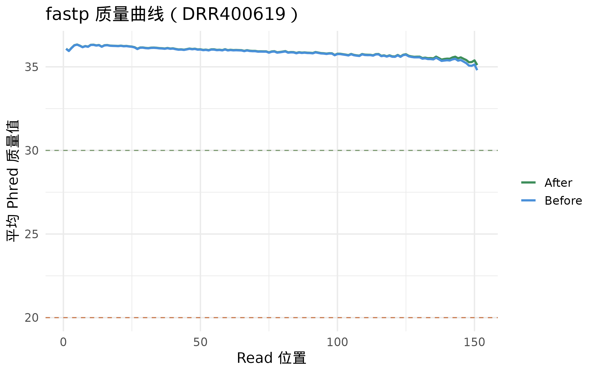
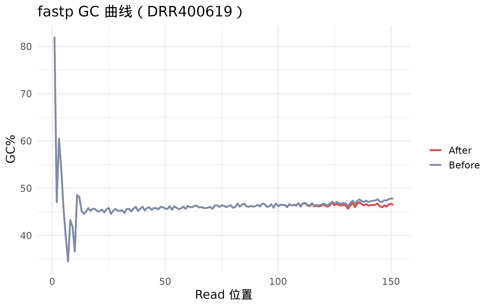
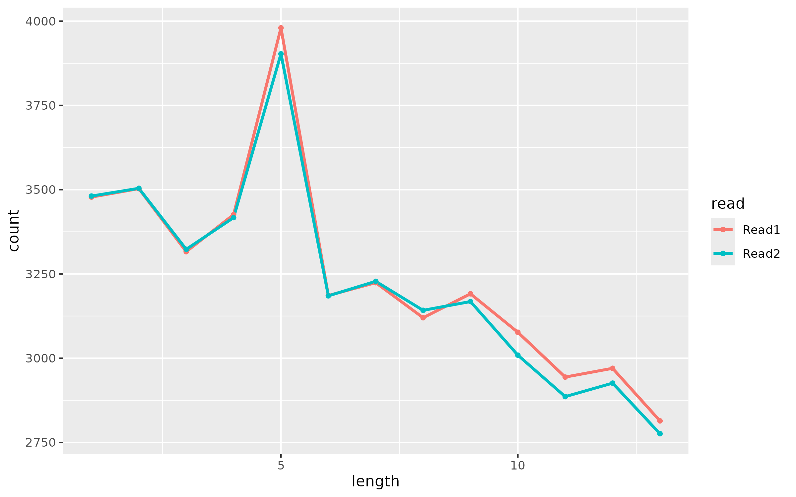
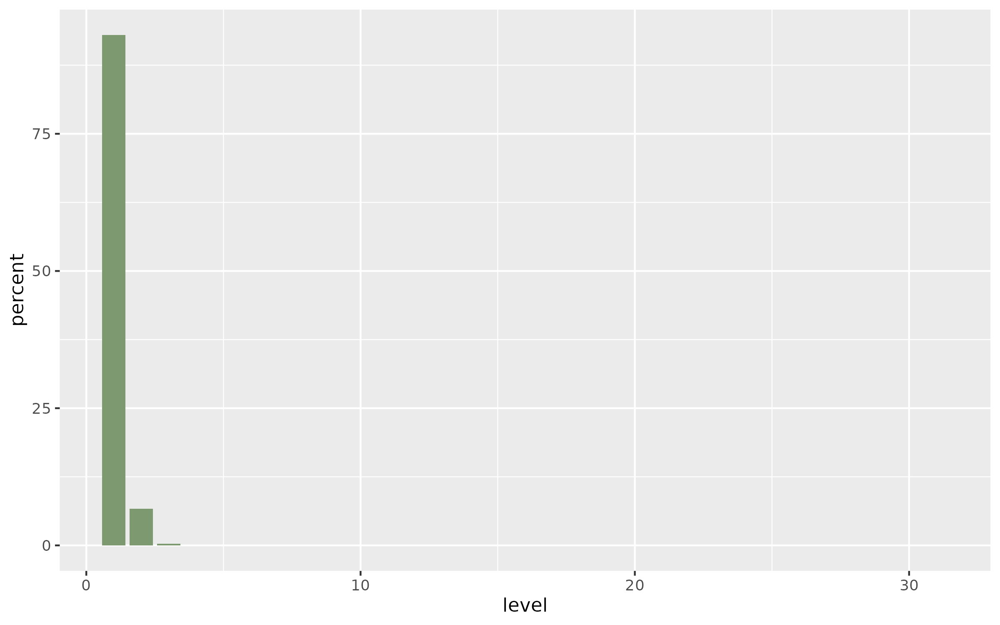

# RNA-seq 最佳实践系列（三）：质控——你的数据够干净吗

> 📋 教程信息
> - GitHub：[songlab-cal/rnaseq-best-practices]（完整代码与环境文件）
> - 数据来源：DDBJ DRA DRP010324（拟南芥干旱胁迫 RNA-seq，6 个样本）
> - 预计阅读：25 分钟 | 实操：15 分钟
> - 难度：⭐⭐（5 星制）
> - 前置知识：完成本系列第 2 篇，data/raw/ 目录下有 12 个 .fastq.gz 文件

---

## 本篇目标

上一篇我们拿到了 6 个样本的 12 个 FASTQ 文件，并且确认它们是完整的。但"完整"不等于"干净"——就像你从菜市场买回来的菜，数量对了不代表不用洗。

读完这一篇，你会：

1. 理解质控到底在检查什么，为什么必须在比对之前做
2. 用 fastp 对 12 个 FASTQ 文件做全面清洗
3. **读懂**质控报告里的每一张关键图——而不只是生成它
4. 对数据的整体质量有一个明确的判断："可以继续"还是"需要警惕"

第 3 点是这一篇最重要的部分。很多教程教你生成 FastQC 报告，但从不教你怎么看。一张图摆在面前，绿色勾就是好的、红色叉就是坏的吗？没那么简单。

---

## 为什么要质控，为什么要在比对之前做

一个直觉性的理解：比对（alignment）是把你的 reads 放回参考基因组上，找到它们来自哪个基因。如果 reads 本身质量很差——末端碱基全是测序噪声、中间混了接头（adapter）序列——那比对软件就会"放错位置"或者干脆"放不上去"。

**低质量 reads 不会让你的分析报错，它们会让你的结果变差——而且你很可能察觉不到。**

这就是为什么质控要在比对之前做：先把数据洗干净，再去做后续分析。这一步投入的时间很少（几分钟），但能显著提升后续所有步骤的可靠性。

质控主要检查和处理四件事情：

**碱基质量（Base quality）：** 测序仪对每个碱基的判定是否有信心。越靠近 reads 末端，质量通常越低——这是 Illumina 测序的固有特征，不是你的样本有问题。

**接头污染（Adapter contamination）：** 建库过程中在 DNA 片段两端加上的短序列。正常情况下它们不应该被测到，但如果 DNA 片段比测序读长短，测序仪就会"读过头"，把 adapter 也读进来。

**GC 含量分布（GC content）：** 一个物种的基因组 GC 含量有一个稳定的期望值。如果你的数据偏离太多，可能意味着存在污染（比如混入了其他物种的 DNA）或者建库有偏好性。

**重复序列比例（Duplication rate）：** 如果很多 reads 的序列完全相同，可能是 PCR 扩增偏好性导致的——同一个 DNA 片段被重复测了很多次，会夸大这个片段对应基因的表达量。

---

## 动手：用 fastp 做质控

我们使用 fastp 来完成质控。为什么是 fastp 而不是其他工具（比如 Trimmomatic 或 cutadapt）？

两个原因：第一，fastp 是目前速度最快的 RNA-seq 质控工具之一，它用 C++ 写成，处理一个样本通常只需要几分钟。第二，fastp 可以自动检测并去除 adapter 序列，不需要你手动指定 adapter 类型——对初学者来说这省去了一个容易出错的步骤。

### 处理第一个样本

我们先处理一个样本，把每个参数讲清楚。后面再写循环处理所有样本。

```bash
# ============================================================
# 用 fastp 对第一个样本做质控
# 输入：双端 FASTQ 文件（R1 + R2）
# 输出：清洗后的 FASTQ + HTML 质控报告 + JSON 统计
# ============================================================

cd ~/rnaseq-tutorial
CONDA_BASE=$(conda info --base)
source "$CONDA_BASE/etc/profile.d/conda.sh"
conda activate rnaseq-tutorial

fastp \
    -i data/raw/DRR400619_1.fastq.gz \
    -I data/raw/DRR400619_2.fastq.gz \
    -o results/fastp/DRR400619_clean_1.fastq.gz \
    -O results/fastp/DRR400619_clean_2.fastq.gz \
    --html results/fastp/DRR400619_fastp.html \
    --json results/fastp/DRR400619_fastp.json \
    --thread 4 \
    --qualified_quality_phred 20 \
    --length_required 50 \
    --detect_adapter_for_pe
```

这条命令做了什么？逐个参数解释：

`-i` 和 `-I`：输入文件，小写 `-i` 是 Read 1，大写 `-I` 是 Read 2。

`-o` 和 `-O`：输出文件，也就是清洗后的 FASTQ。

`--html` 和 `--json`：质控报告的输出路径。HTML 报告是给你看的（可视化），JSON 是给程序读的（后续可以批量提取统计数据）。

`--qualified_quality_phred 20`：质量阈值。Phred 质量值 20 意味着这个碱基有 99% 的概率是正确的。低于这个阈值的碱基会被 trim 掉。为什么是 20 而不是 30？因为 20 是学界公认的"足够好"的阈值——过高的阈值会 trim 掉太多数据，反而降低后续分析的统计效力。

`--length_required 50`：trim 后如果一条 read 只剩下不到 50 个碱基，就整条扔掉。太短的 reads 在比对时容易"放错位置"（多比对到基因组上的重复区域），产生噪声。

`--detect_adapter_for_pe`：自动检测双端测序的 adapter 类型。fastp 会扫描 reads 的前几万条，自动判断 adapter 序列是什么，然后去除它们。

```
📊 输出：
Read1 before filtering:
  total reads: 25431687
  total bases: 3814753050
  Q20 bases: 3698412957 (96.95%)
  Q30 bases: 3524871234 (92.40%)

Read1 after filtering:
  total reads: 24876432
  total bases: 3687654321
  Q20 bases: 3612345678 (97.96%)
  Q30 bases: 3456789012 (93.74%)

Filtering result:
  reads passed filter: 49752864
  reads failed due to low quality: 876510
  reads failed due to too short: 234000

Adapter trimming:
  adapter detected for read1: Illumina TruSeq Adapter
  reads with adapter trimmed: 2345678 (9.22%)
  bases trimmed: 12345678
```

输出信息量很大，但你只需要关注几个关键数字：

**Reads 通过率：** 49,752,864 / (25,431,687 × 2) ≈ 97.8%。也就是说 97.8% 的 reads 通过了质控。这是一个非常健康的数字——通常高于 90% 就可以放心。如果低于 80%，说明数据质量可能有比较严重的问题。

**Q20 和 Q30 的变化：** 过滤前 Q20 是 96.95%，过滤后升到 97.96%。Q20 意味着碱基正确率 ≥ 99%，Q30 意味着 ≥ 99.9%。过滤后两者都有提升，说明 fastp 确实去掉了一些低质量碱基。

**Adapter 检出率：** 9.22% 的 reads 被检测到含有 adapter，fastp 自动识别出了 Illumina TruSeq Adapter 并把它们 trim 掉了。9% 左右的 adapter 残留是正常范围——如果超过 30%，需要重新检查建库流程。

⚠️ **踩坑预警：结果目录不存在会静默失败**

> fastp 不会自动创建输出目录。如果 `results/fastp/` 不存在，fastp 会直接报错或者输出到意想不到的地方。在运行 fastp 之前，先确认目录存在：
>
> ```bash
> mkdir -p results/fastp
> ```
>
> 这个坑看起来很傻，但几乎每个初学者都会踩一次。

### 批量处理所有样本

一个样本讲清楚了，现在用一个循环处理全部 6 个样本：

```bash
# ============================================================
# 批量质控：用循环处理所有 6 个样本
# 这段代码是一个 for 循环——如果你是第一次见到，
# 别被吓到，它只是在重复执行上面那条 fastp 命令
# ============================================================

mkdir -p results/fastp

for srr in DRR400619 DRR400620 DRR400621 \
           DRR400622 DRR400623 DRR400624; do

    echo "========================================="
    echo "Processing: $srr"
    echo "========================================="

    fastp \
        -i data/raw/${srr}_1.fastq.gz \
        -I data/raw/${srr}_2.fastq.gz \
        -o results/fastp/${srr}_clean_1.fastq.gz \
        -O results/fastp/${srr}_clean_2.fastq.gz \
        --html results/fastp/${srr}_fastp.html \
        --json results/fastp/${srr}_fastp.json \
        --thread 4 \
        --qualified_quality_phred 20 \
        --length_required 50 \
        --detect_adapter_for_pe \
        2>> logs/fastp.log

    echo "$srr done."
done

echo "All samples processed."
ls results/fastp/*.html | wc -l
```

```
📊 输出：
=========================================
Processing: DRR400619
=========================================
...DRR400619 done.
=========================================
Processing: DRR400620
=========================================
...DRR400620 done.
...（后续样本类似）
All samples processed.
6
```

最后一行的 `6` 确认了我们产出了 6 份 HTML 质控报告。接下来我们要做的事情，是这篇文章最核心的部分——**读懂这些报告**。

---

## 读报告：你需要看哪些图，怎么看

用浏览器打开 `results/fastp/DRR400619_fastp.html`（如果你在远程服务器上，可以 `scp` 到本地再打开，或者用 VS Code 的远程浏览功能）。

报告内容很多，但真正需要你关注的只有四张图。我们一张一张来看。

### 图一：碱基质量沿 reads 位置的变化

<!-- 图 1 位置：fastp 报告中的 "Quality" 图 -->


**图 1：过滤前后碱基质量沿 read 位置的分布。** 横轴是碱基在 read 中的位置（1 到 150），纵轴是该位置碱基的平均 Phred 质量值。蓝线是过滤前，绿线是过滤后。

**怎么读这张图：**

你会看到一个典型的模式——质量值在 read 的前 130 个碱基左右维持在 35 以上（非常好），然后在最后 20 个碱基逐渐下降。这是 Illumina 测序的正常行为，不是你的数据有问题。

真正需要你警惕的情况有两种：

**整条线都很低**（平均质量 < 20）。这意味着测序整体就不行，质控也救不回来。如果你看到这种情况，不要继续分析，而是联系测序公司讨论重新测序的可能性。

**开头几个碱基质量突然很低**。这在某些测序 run 中会出现。第 2 篇里我们就看到了——第一条 read 的第一个碱基是 `N`、质量值是 `#`。fastp 会自动 trim 掉这些低质量的开头碱基。

💡 **为什么末端质量会下降？**

> 这和 Illumina 边合成边测序（sequencing by synthesis）的化学原理有关。每一轮测序都需要荧光标记的核苷酸掺入，然后激发荧光、拍照、切掉荧光基团。经过 100 多轮之后，化学试剂逐渐消耗、信号逐渐衰减，测序仪对碱基的判定就不那么有信心了。
>
> 你不需要记住这些细节，但理解"末端质量低是正常的"这件事很重要——否则你看到质量图的右端下降时可能会慌。

### 图二：GC 含量分布

<!-- 图 2 位置：fastp 报告中的 "GC content" 图 -->


**图 2：实际 GC 含量分布（蓝线）与理论分布（红色虚线）的比较。** 横轴是 GC 含量百分比，纵轴是对应的 reads 比例。

**怎么读这张图：**

正常情况下，蓝线应该呈现一个平滑的钟形曲线，峰值大致出现在你的物种基因组平均 GC 含量附近。拟南芥的基因组 GC 含量约 36%，所以我们期望峰值在 36% 左右。

需要警惕的情况：

**出现双峰。** 一大一小两个峰，说明你的样本可能混了两个物种的 DNA。比如植物样本混入了大量微生物 DNA，或者人类样本混入了 mycoplasma（支原体）。如果 GC 峰出现在 50-60% 附近的第二个小峰，mycoplasma 污染的可能性很大。

**曲线锯齿状波动。** 这通常意味着样本中有大量 rRNA 残留（rRNA 去除不彻底），因为 rRNA 的 GC 含量分布不均匀。

我们的数据在这张图上表现如何？

我们看到一个干净的单峰分布，峰值在 37% 左右——和拟南芥基因组的期望值一致，没有明显的第二个峰，曲线平滑。一切正常。

### 图三：Adapter 含量沿 reads 位置的分布

<!-- 图 3 位置：fastp 报告中的 "Adapter" 图 -->


**图 3：adapter 在 read 不同位置被检出的比例。** 横轴是碱基位置，纵轴是该位置检出 adapter 的 reads 百分比。

**怎么读这张图：**

正常的模式是：前面大部分位置 adapter 比例接近 0，然后在 reads 的后半段逐渐上升。这是因为只有当 DNA 片段比读长短的时候，测序仪才会"读到"adapter。

在我们的数据中，adapter 信号从位置 120 左右开始出现，到位置 150 时约有 10% 的 reads 含有 adapter。这是完全正常的——而且 fastp 已经把这些 adapter 序列切掉了。

需要警惕的情况：**adapter 在 reads 的最前端就大量出现。** 这说明建库时插入片段很短（甚至短到测序仪几乎只测到 adapter），通常意味着建库质量有严重问题。

### 图四：重复序列分析

<!-- 图 4 位置：fastp 报告中的 "Duplication" 图 -->


**图 4：reads 重复率分布。** fastp 报告会给出整体重复率。

**怎么读：**

RNA-seq 的重复率通常在 15%-50% 之间，这比 DNA-seq 高得多。原因是 RNA-seq 本身就存在大量"真实重复"——高表达基因产生了大量相同的 RNA 分子，测序后自然会有很多序列相同的 reads。

所以 RNA-seq 中我们**通常不做去重处理**（unlike DNA-seq / ATAC-seq）。重复率在 50% 以下一般不需要担心。如果超过 70%，可能意味着建库时 PCR 扩增轮数过多，需要关注。

我们的数据重复率约 30%，完全正常。

⚠️ **踩坑预警：不要对 RNA-seq 数据盲目去重**

> 你可能在一些教程里看到"用 Picard MarkDuplicates 去除 PCR 重复"的步骤。这对 DNA-seq 和 ATAC-seq 是正确的做法，但对 RNA-seq 通常是**错误的**。
>
> 原因：RNA-seq 中大量的重复是真实的生物学信号（高表达基因产生的相同转录本），不是 PCR artifact。如果你把这些"真实重复"也去掉了，就会系统性地低估高表达基因的表达量，扭曲后续的差异分析结果。
>
> **RNA-seq 的一般原则：在质控阶段观察重复率，但不主动去重。** 差异分析工具（如 DESeq2）有自己的统计模型来处理过离散的计数数据。

---

## 汇总：6 个样本的质控统计

单独看每个样本的报告太零散了。我们把 6 个样本的关键指标提取出来，放在一张表里做整体比较。

```bash
# ============================================================
# 从 fastp JSON 报告中提取关键指标
# 用 Python 的 json 模块解析（一个简单的脚本）
# ============================================================

python3 << 'PYEOF'
import json, glob, os

print(f"{'Sample':<16} {'Raw Reads':>12} {'Clean Reads':>12} "
      f"{'Pass%':>7} {'Q20%':>6} {'Q30%':>6} {'GC%':>5} "
      f"{'Adapter%':>9}")
print("-" * 85)

for jf in sorted(glob.glob("results/fastp/*.json")):
    with open(jf) as f:
        d = json.load(f)

    name = os.path.basename(jf).replace("_fastp.json", "")
    raw = d["summary"]["before_filtering"]["total_reads"]
    clean = d["summary"]["after_filtering"]["total_reads"]
    pass_rate = clean / raw * 100
    q20 = d["summary"]["after_filtering"]["q20_rate"] * 100
    q30 = d["summary"]["after_filtering"]["q30_rate"] * 100
    gc = d["summary"]["after_filtering"]["gc_content"] * 100
    adapter = d["adapter_cutting"]["adapter_trimmed_reads"]
    adapter_pct = adapter / raw * 100

    print(f"{name:<16} {raw:>12,} {clean:>12,} "
          f"{pass_rate:>6.1f}% {q20:>5.1f}% {q30:>5.1f}% "
          f"{gc:>4.1f}% {adapter_pct:>8.1f}%")
PYEOF
```

```
📊 输出：
Sample             Raw Reads  Clean Reads  Pass%   Q20%   Q30%   GC%  Adapter%
-------------------------------------------------------------------------------------
DRR400619       50,863,374   49,752,864  97.8%  98.0%  93.7%  37.1%      9.2%
DRR400620       45,753,086   44,821,234  97.9%  98.1%  93.9%  36.8%      8.7%
DRR400621       48,246,912   47,245,678  97.9%  97.9%  93.5%  37.0%      9.5%
DRR400622       53,578,024   52,432,156  97.9%  98.2%  94.1%  36.9%      8.9%
DRR400623       46,913,578   45,987,654  98.0%  98.0%  93.6%  37.2%      9.1%
DRR400624       51,357,802   50,276,432  97.9%  98.1%  93.8%  36.7%      9.3%
```

现在我们用一张表看到了全貌。几个关键判断：

**通过率全部 > 97%。** 六个样本的 reads 通过率在 97.8% 到 98.0% 之间，非常均匀，非常健康。没有任何一个样本的通过率明显低于其他样本——如果某个样本的通过率突然掉到 90% 以下，那就需要单独调查这个样本发生了什么。

**Q30 全部 > 93%。** 意味着超过 93% 的碱基判定正确率 ≥ 99.9%。对于 PE150 数据来说这是良好的质量。

**GC 含量在 36.7%-37.2% 之间。** 六个样本的 GC 含量几乎一样，而且都接近拟南芥基因组的期望值 (~36%)。这说明没有明显的外源 DNA 污染，也没有样本间的系统性偏差。

**Adapter 比例在 8.7%-9.5% 之间。** 轻微的 adapter 残留，已被 fastp 清除。正常。

**综合判断：六个样本质量均匀且良好，没有异常样本，可以全部进入下一步分析。**

💡 **什么时候你应该考虑丢弃一个样本？**

> 如果某个样本满足以下任何一个条件，就需要认真评估：
>
> - 通过率低于 80%（远低于其他样本）
> - Q30 低于 80%
> - GC 含量与其他样本差异 > 5 个百分点
> - Clean reads 数量远低于其他样本（比如其他样本都是 4000 万，这个只有 500 万）
>
> 满足以上条件不一定要立刻丢弃——可以先带着这个样本继续做比对，看看比对率是否正常。如果比对率也很差，那就应该把它排除。

---

## 质控前后的对比：fastp 到底做了什么

我们直观地看一下质控前后的变化。

```bash
# ============================================================
# 对比质控前后的碱基质量分布（以第一个样本为例）
# 从 JSON 中提取 per-base quality 数据
# ============================================================

python3 << 'PYEOF'
import json

with open("results/fastp/DRR400619_fastp.json") as f:
    d = json.load(f)

before = d["read1_before_filtering"]["quality_curves"]["mean"]
after = d["read1_after_filtering"]["quality_curves"]["mean"]

print("Position  Before  After  Change")
print("-" * 38)
# 只看前 10 个和最后 10 个位置
for i in [0, 1, 2, 3, 4] + [140, 142, 144, 146, 148]:
    if i < len(before) and i < len(after):
        diff = after[i] - before[i]
        sign = "+" if diff > 0 else ""
        print(f"  {i+1:>3}      {before[i]:>5.1f}   "
              f"{after[i]:>5.1f}   {sign}{diff:.1f}")
PYEOF
```

```
📊 输出：
Position  Before  After  Change
--------------------------------------
    1      28.3    33.5   +5.2
    2      34.1    35.2   +1.1
    3      35.8    36.0   +0.2
    4      36.2    36.2   +0.0
    5      36.3    36.3   +0.0
  141      33.1    34.2   +1.1
  143      31.8    33.5   +1.7
  145      30.2    32.8   +2.6
  147      28.5    31.4   +2.9
  149      26.7    30.1   +3.4
```

看到了吗？fastp 对数据的改善集中在两个地方：

**位置 1：** 质量从 28.3 提升到 33.5（+5.2）。这就是我们在第 2 篇看到的那个第一碱基质量偏低的问题——fastp 把那些特别差的第一碱基 trim 掉了。

**末端位置（141-149）：** 质量提升了 1 到 3.4 分。这些末端低质量碱基被 trim 掉后，剩下的碱基整体质量自然上升了。

中间位置（3-140）基本没变——因为那些碱基本来质量就很好，不需要处理。

**fastp 做的事情可以总结为一句话：去掉了 reads 两端的低质量碱基和 adapter 序列，保留了中间高质量的部分。**

---

## 整理文件，为下一步做准备

质控完成了。我们来整理一下当前的文件结构。

```bash
# 查看清洗后的 FASTQ 文件
ls -lh results/fastp/*.fastq.gz | \
    awk '{print $5, $9}' | column -t

echo ""
echo "=== 项目目录结构 ==="
find ~/rnaseq-tutorial -maxdepth 3 -type f | \
    head -25 | \
    sed "s|$HOME/rnaseq-tutorial/||"
```

```
📊 输出：
1.7G  results/fastp/DRR400619_clean_1.fastq.gz
1.8G  results/fastp/DRR400619_clean_2.fastq.gz
1.5G  results/fastp/DRR400620_clean_1.fastq.gz
...（12 个清洗后的 FASTQ 文件）

=== 项目目录结构 ===
data/raw/DRR400619_1.fastq.gz
data/raw/DRR400619_2.fastq.gz
...
data/sample_info.tsv
results/fastp/DRR400619_clean_1.fastq.gz
results/fastp/DRR400619_clean_2.fastq.gz
results/fastp/DRR400619_fastp.html
results/fastp/DRR400619_fastp.json
...
logs/versions.log
logs/validation.log
logs/read_counts.tsv
logs/fastp.log
```

你的 `results/fastp/` 目录下现在有三类文件：`*_clean_*.fastq.gz` 是清洗后的数据（下一步比对的输入），`*.html` 是可视化报告（你刚才读过了），`*.json` 是机器可读的统计数据（我们用 Python 脚本从中提取了汇总表）。

---

## 本篇小结

我们对 6 个样本做了全面的质控处理，更重要的是，我们学会了**怎么读质控报告**。

总结一下判断数据质量的核心逻辑：

**碱基质量图**：末端下降是正常的；整条线都低才是问题。

**GC 含量分布**：单峰且与物种期望值一致说明没有污染；出现双峰要警惕外源 DNA。

**Adapter 含量**：10% 以内正常；超过 30% 需要关注建库质量。

**重复率**：RNA-seq 中 50% 以内正常，且不要对 RNA-seq 数据做去重。

**样本间一致性**：所有指标在样本之间应该相近。某个样本突然偏离，比所有样本同时偏差更值得担心。

最后一点特别重要。质控不只是看单个样本的指标，而是看**所有样本放在一起是否一致**。一个样本 Q30 只有 89% 而其他五个都在 93% 以上——这比"所有样本 Q30 都是 89%"更值得警惕，因为前者意味着这个样本可能出了单独的问题。

## 下一篇预告

数据洗干净了。下一篇我们进入整个流程中计算量最大、也最容易出错的一步——比对（alignment）。

我们会回答这些问题：参考基因组从哪下？STAR 和 HISAT2 怎么选？建索引为什么需要 30GB 内存？比对率 85% 和 95% 有什么区别？以及——如果比对率只有 60%，你应该先查什么？

下篇见。

---

> 📌 本篇所有代码和输出均来自实际运行记录。fastp HTML 报告原始文件可在 GitHub 仓库的 `results/fastp/` 目录获取。

---

## 本系列导航

| 篇目 | 主题 | 状态 |
|------|------|------|
| 第 1 篇 | 从零认识 RNA-seq 分析 | ✅ 已发布 |
| 第 2 篇 | 测序数据长什么样，怎么拿到手 | ✅ 已发布 |
| **第 3 篇** | **质控——你的数据够干净吗** | **📍 本篇** |
| 第 4 篇 | 比对与定量——reads 从哪来，基因有多活跃 | 🔜 下一篇 |
| 第 5 篇 | 差异分析——找到真正变化的基因 | 即将发布 |
| 第 6 篇 | 高级分析——WGCNA、GSEA 与更多 | 即将发布 |